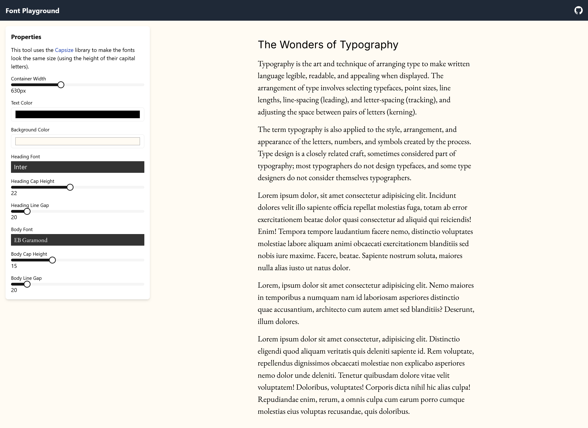

# Font Playground

A tool to help you pick fonts by comparing them in a visually similar way.

You can modify the container width, text and background colors, and the cap height, line gap, and font for both the heading and body text.

## Uses

-   [React Fontpicker](https://github.com/ae9is/react-fontpicker)
-   [Capsize](https://seek-oss.github.io/capsize/)
-   [Shadcn UI](https://ui.shadcn.com)
-   [TailwindCSS](https://tailwindcss.com/)
-   [Vite](https://vitejs.dev/)
-   [create-vite](https://github.com/vitejs/vite/tree/main/packages/create-vite)
-   [SWC](https://swc.rs/)

## License

Apache-2.0